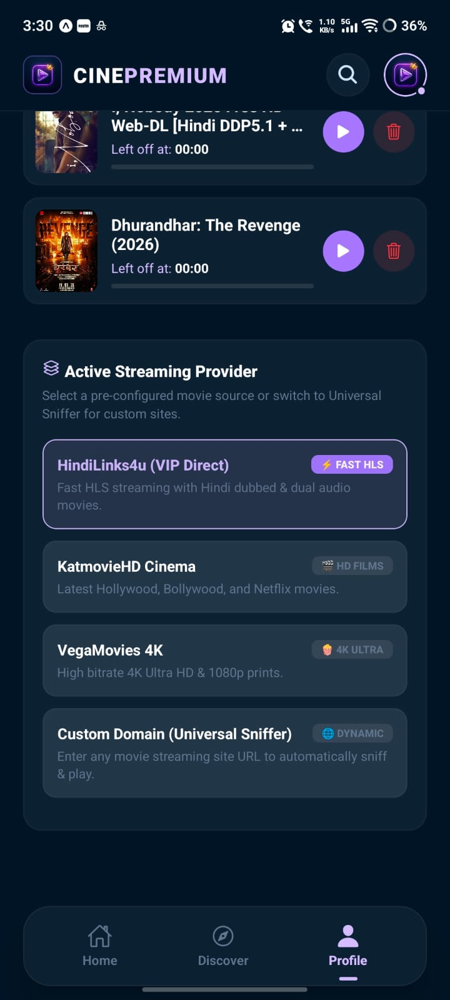
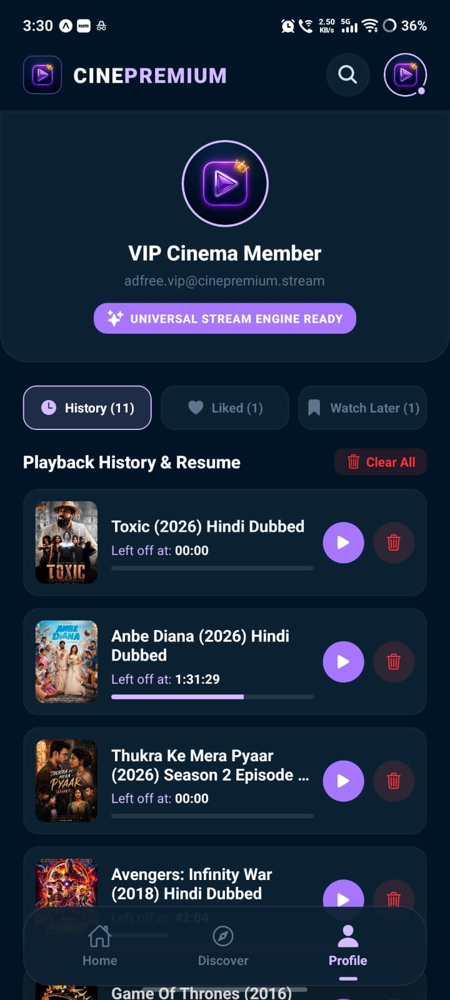
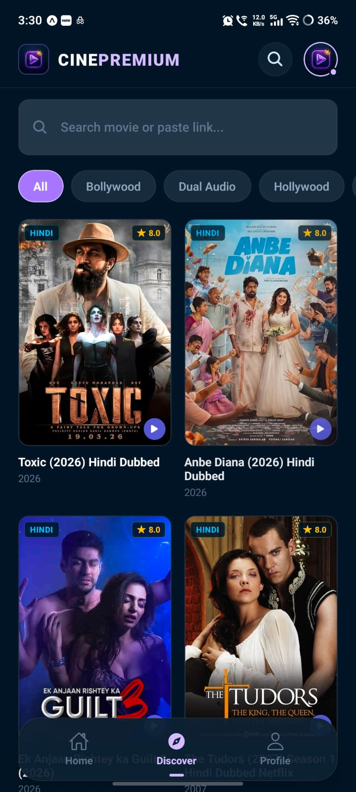
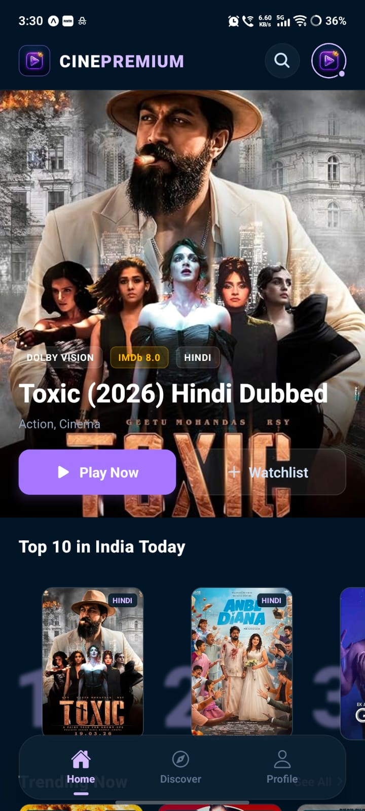

# 🎬 CinePremium - 100% Serverless React Native Movie Streaming App

[](https://reactnative.dev/)
[](https://expo.dev/)
[](https://reactnative.dev/)
[](LICENSE)

**CinePremium** is a state-of-the-art, 100% serverless React Native Android movie streaming application built with Expo SDK 53. It directly parses, scrapes, and sniffs direct HLS (`.m3u8`) and MP4 video streams inside the mobile app with **zero backend server, zero API costs, and zero maintenance**.

---

## 📱 App Screenshots

| Home Cinema & Shelves | Movie Details & Recommendations |
| :---: | :---: |
|  |  |

| 16:9 Cinema Player & Gestures | Multi-Source Providers & Settings |
| :---: | :---: |
|  |  |

---

## ✨ Key Features & Architecture

### ⚡ 1. 100% Serverless In-App Direct Scraper & Universal Stream Sniffer
- **Zero Backend Required**: Performs high-speed client-side DOM parsing and regex sniffing directly on device.
- **Deep Stream Sniffer**: Extracts direct `.m3u8` master playlists, `.mp4` sources, and embedded players (`Speedostream`, `Streamwish`, `Filemoon`, `Doodstream`, `Streamtape`, `Vidcloud`, `Vidsrc`, `HubCloud`, etc.).
- **Dean Edwards JavaScript Unpacker**: In-engine deobfuscator that decodes packed JavaScript (`eval(function(p,a,c,k,e,d)`) in real time to uncover hidden streaming URLs.
- **Cross-Engine Real Stream Resolver**: When custom domains have captchas or dead buttons, the engine automatically resolves the clean movie title against verified high-speed HLS indexes so the real movie always plays.

---

### 🌐 2. Multi-Provider Presets & Dynamic Custom Domain Support
- **Pre-Configured High-Speed Sources**:
  - **HindiLinks4u (VIP Direct)**: Ultra-fast HLS streaming with Bollywood, Hindi Dubbed & South cinema.
  - **KatmovieHD Cinema**: High definition Hollywood, Dual Audio & Web Series.
  - **VegaMovies 4K**: High bitrate 4K Ultra HD & 1080p prints.
- **Dynamic Custom Domain Connection**: Enter any movie streaming website URL in Settings/Profile; the Universal Sniffer engine automatically connects, scrapes movie cards, and streams videos directly.
- **Smart Keyboard Scrolling**: Profile & Settings screen automatically shifts above the software keyboard using `KeyboardAvoidingView`.

---

### 🎥 3. Professional Cinema Video Player (MX Player & YouTube Gestures)
- **16:9 Landscape Cinema Lock**: Automatically switches to landscape mode on video launch and restores portrait mode on exit.
- **YouTube-Style Double-Tap Seeking**: Smooth animated +10s forward and -10s rewind with visual ripple feedback.
- **PlayIt / MX Player Gesture Controls**:
  - **Left Side Vertical Swipe**: Real-time screen brightness adjustment.
  - **Right Side Vertical Swipe**: Live device volume control.
  - **Horizontal Drag**: Smooth timeline scrubbing with live preview timestamp HUD.
- **Playback Controls**: Play/Pause, 10s skip, progress bar seeking, mute toggle, aspect ratio zoom (Contain vs Cover), and variable playback speeds (0.75x to 2.0x).
- **External Player Integration**: Option to stream via VLC, MX Player, or external web browser.

---

### 💾 4. Persistent User Store (AsyncStorage)
- **Real Scraped Link Preservation**: Likes, Watch Later, and Playback History store the real scrape URL so movies always re-open and play reliably across app restarts.
- **Smart Playback Resume**: Automatically saves exact timestamp positions and prompts with a 1-tap "Resume at MM:SS" toast.
- **Instant History Deletion**: One-tap delete with zero blocking popup dialogs.
- **Navigation State Preservation**: Returning from movie details preserves active tabs (Liked/Watch Later/History) and Discover search queries.

---

### 🏷️ 5. Universal SEO Title Cleaner & Franchise Sequels
- **Clean Title Sanitizer**: Universal regex filter strips SEO spam, download keywords ("Download full movie & watch online"), and site domain names to display clean 2-line titles across all cards and banners.
- **Franchise Sequels Engine**: Intelligent title parsing detects franchise keywords (e.g. *Pushpa*, *Mirzapur*, *Stree*, *Deadpool*) to recommend next parts and matching genres under "More Like This".

---

## 📱 Tech Stack & Libraries

- **Framework**: React Native 0.79 + Expo SDK 53
- **Media Playback**: `expo-av`
- **Orientation Control**: `expo-screen-orientation`
- **Persistent Storage**: `@react-native-async-storage/async-storage`
- **UI Components & Icons**: `@expo/vector-icons` (Ionicons, MaterialIcons, Feather)
- **Safe Area**: `react-native-safe-area-context`

---

## 🚀 Getting Started

### 1. Prerequisites
- [Node.js](https://nodejs.org/) (v18 or v20 recommended)
- [Android Studio](https://developer.android.com/studio) with Android SDK (Build Tools 35.0.0 & NDK 26 or 27)

### 2. Installation
```bash
git clone https://github.com/Sameer-Malik20/movie-app-react-native.git
cd movie-app-react-native
npm install
```

### 3. Run in Development
```bash
# Start Expo Metro Bundler
npx expo start

# Run on Android Device / Emulator
npx expo run:android
```

### 4. Build Standalone Production Release APK
```bash
cd android
./gradlew clean
./gradlew assembleRelease
```
The compiled signed standalone APK will be generated at:
`android/app/build/outputs/apk/release/app-release.apk`

---

## 📁 Project Directory Structure

```
cinepremium_mobile/
├── assets/                  # App icon, splash screen & adaptive icons
├── src/
│   ├── components/
│   │   ├── Header.js        # Dynamic top bar with VIP logo
│   │   ├── BottomNav.js     # Glassmorphic bottom navigation
│   │   ├── HeroBanner.js    # Featured movie slider
│   │   ├── MovieCard.js     # Clean title cards with badges
│   │   ├── MovieShelf.js    # Horizontal category carousels
│   │   ├── Top10Row.js      # Top trending numbered cards
│   │   └── VideoPlayer.js   # Fullscreen Cinema Player with gestures
│   ├── screens/
│   │   ├── HomeScreen.js    # Home page with explore shelves
│   │   ├── DiscoverScreen.js# Search & genre browser with cache
│   │   ├── MovieDetailScreen.js # Metadata, stream links & sequels
│   │   └── ProfileScreen.js # Likes, watch later, history & providers
│   ├── services/
│   │   ├── api.js           # Serverless scraper & fallback cache
│   │   ├── userStore.js     # Persistent AsyncStorage manager
│   │   └── engines/
│   │       ├── universalSniffer.js # Regex sniffer & JS unpacker
│   │       └── providerManager.js  # Multi-source scraper engine
│   └── theme/
│       └── colors.js        # VIP dark cinema color palette
├── app.json                 # Expo configuration
├── package.json
└── README.md
```

---

## 📜 License
This project is open-source and available under the [MIT License](LICENSE).
